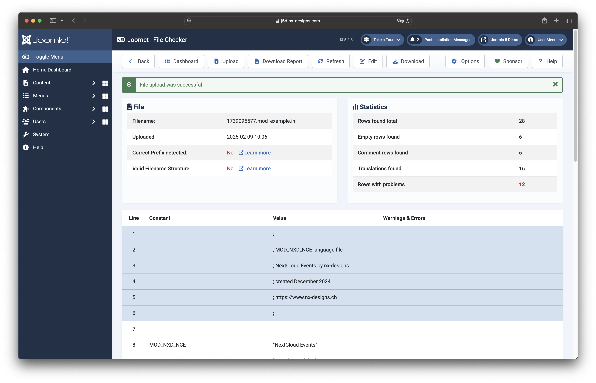
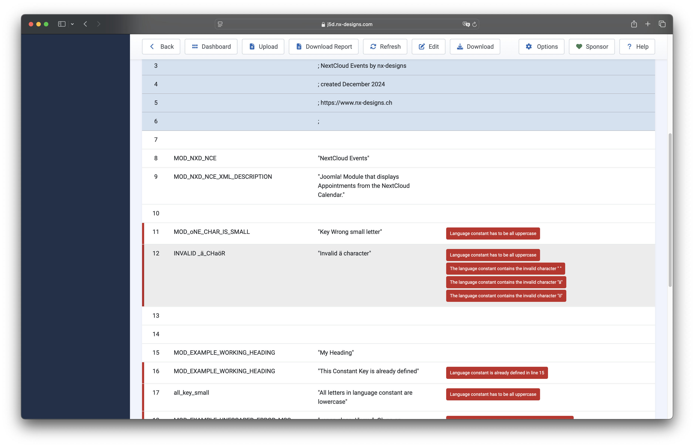
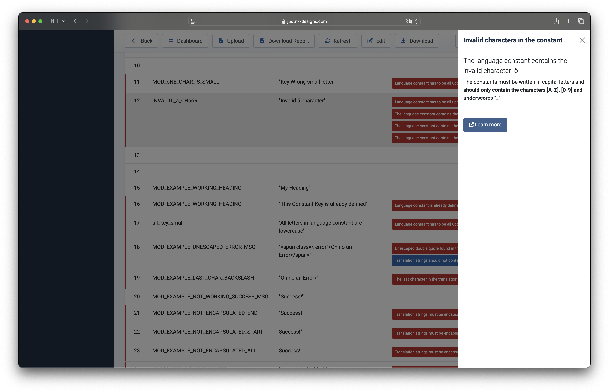

## Checks that will be made by this Component

### File

The file is checked to see whether the file name complies with the current guidelines. If this is not the case, 
a corresponding message with further information is displayed.

### Constant

The constants are subjected to the following checks:

- Lowercase characters
- Invalid characters
- Duplicate check (check whether the constant has already been defined)

### Translation String

The translations are subjected to the following checks:

- Correct encapsulation with double inverted commas
- Ensure that the last character in the string is not a backslash
- Check that all double inverted commas have been escaped correctly
- check for HTML content
- check that HTML tags have been closed correctly

:::info
If you have any ideas for further checks, please don't hesitate to let me know.
:::

## Checker Result Screen

After the checks have been carried out, Joomet presents you with an overview of the file checks, statistics and an 
overview of all lines in the file.



Lines with a blue background start with ```;``` are recognised as comment lines.

If problems are detected in a line, this is marked with a red bar on the left and you will find the triggered rule 
in the "Warnings & Errors" column.



Clicking on a recognised problem will then show you further details. If available, you will also find a link to the 
Joomla Developer Manual where the point is discussed in more detail:



The component distinguishes between errors (red), warnings (orange) and notes (blue).
You can use the Edit button in the toolbar to edit the file directly within the component. The editor opens in a new window.

:::note
Some browsers (e.g. Safari) prevent the link to the editor from opening; this can be bypassed using `⌘ + click` on 
Mac or `Ctrl + click` on Windows.
:::


