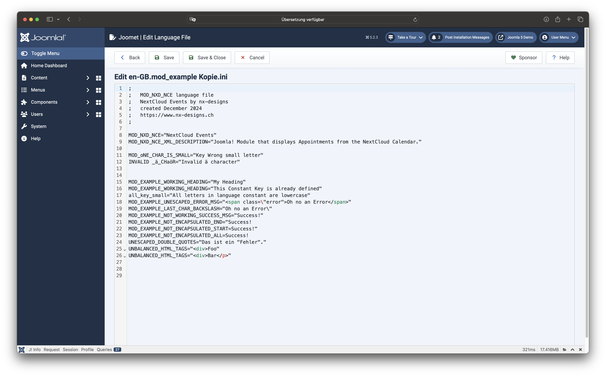

Joomet also includes a very simple editor for your ini files. You can use it to edit all ini files managed in the
component.
We have also given you the possibility to edit the ini files of the locally installed extensions. However, I recommend
that you use this option with caution / to develop your own language files. Errors in third-party language files or even
core files should not be edited. **Joomet does not create a copy of the original file**, you work directly in the actual
file and changes cannot be undone after saving.

:::note
If the CodeMirror plugin is installed & activated in Joomla, CodeMirror is used. If CodeMirror is not available, a
simple textinput field is displayed.
:::