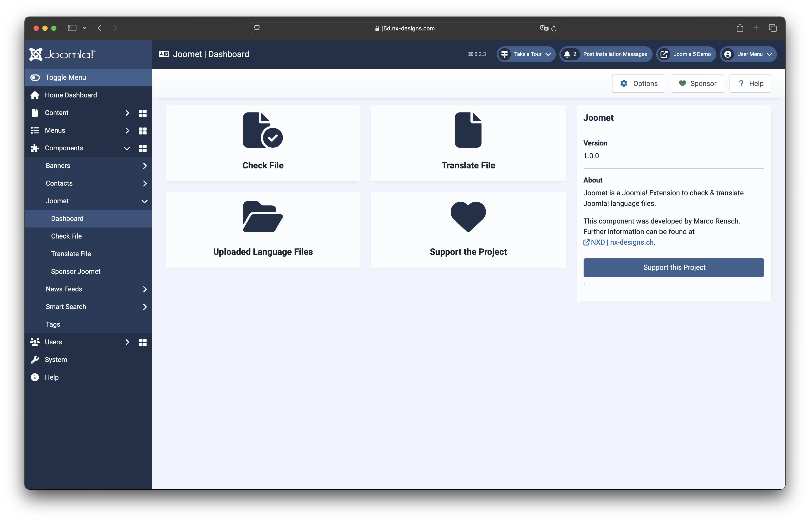

:::warning
I recommend that you only use Joomet in your development environment and not on a productive site.
:::

## What is Joomet?

Joomet was created for the Joomla developer community, it allows you to check the language files of your extensions 
and translate them into dozens of languages within seconds using [DeepL](https://www.deepl.com).

As a backend component for Joomla! 5.x, you can simply run Joomet on your test environment to conveniently check your 
language files in the local installation or via upload. An internet connection is required for the translation services.

## Features

- File Upload
- Check uploaded language file (.ini) for syntax errors
- Check installed language files for syntax errors
- Export Checker Result
- Edit uploaded files directly in the component
- Translate your language file with DeepL (Free / Pro DeepL API Key required)

## Why Joomet?

As a developer, I am passionate about programming extensions for Joomla! However, creating the translations is 
(as we all know) enormously time-consuming. For this reason, I have already programmed the JavaScript desktop 
application "Joomet" for a project in my 2022 degree programme. The next logical step was to develop this as a 
Joomla! component.

## How much does Joomet cost?

The short answer? Nothing! > Joomet was programmed for the Joomla! developer community and should support you in your 
daily work. As a developer you know how much time such a project takes. For all those who appreciate my work and would 
like to support or thank me, there is a "Sponsor" section in Joomet. So if Joomet has saved you time that you can now 
spend with friends or family, I would appreciate a small thank you in the form of a donation.

## Can I also translate extensions that I sell?

Of course! But as already mentioned, I would be delighted to receive a small thank you in the form of a donation. 
Especially if you have earned money with it ;-).

## How good are the translations?

Joomet uses the great DeepL API - so we have no direct influence on the translation quality.

## Where can I get Joomet?

You can directly download Joomet from the public GitHub repository [here](https://github.com/marcorensch/com_joomet/releases). 
You can find the repository itself at [this link](https://github.com/marcorensch/com_joomet).

**Attention:** The project cannot simply be downloaded and installed via the source code. 
Before installation, the dependencies must be installed using Composer. Further information can be found in the readme 
file.

## How can I support you / the project?

You can support me via the two sponsoring methods [here (PayPal)](https://www.paypal.com/ncp/payment/QDZ3XA9V2SDHW) or 
[here (Buy me a Coffee)](https://buymeacoffee.com/nxdesigns). Of course you can also support me in the project itself, 
no application is perfect after all and my "Joomla coding skills" can still be improved. Do you find bugs or do you have 
improvements to the code? Create a pull request or an issue on GitHub and we'll take a look at it.