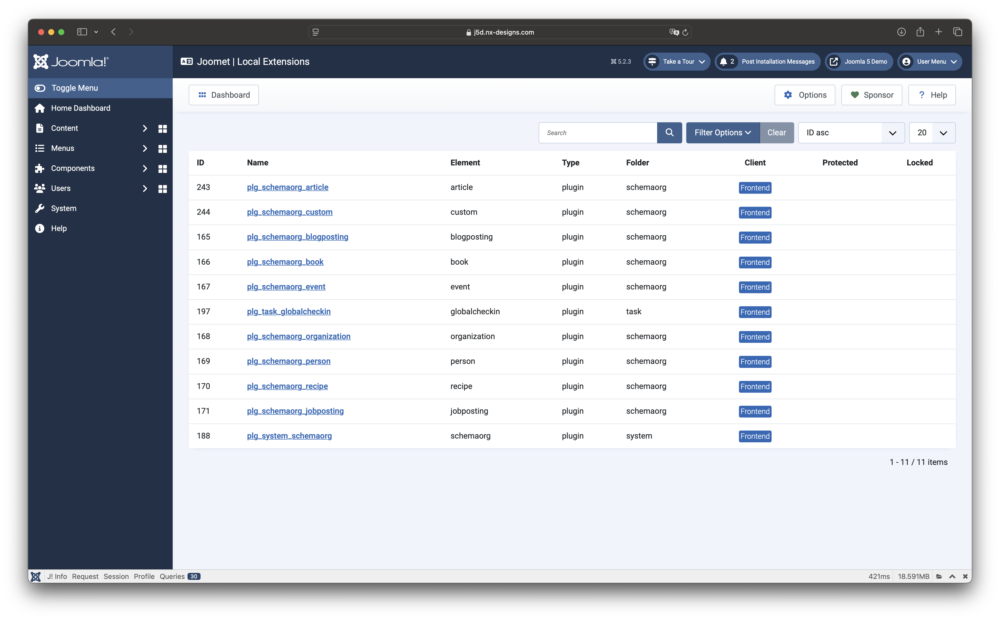

The extension also allows you to check the language files of locally installed extensions. For this purpose, 
the Joomla-specific and the language folders of the extension are searched for files. Select an extension from the 
list to see the language files found.

A click on the name of the extension will then take you to the details page where all the language files found are listed.
language files are listed:

:::info
Joomet does not check which files are actually used in the current installation. In the example shown, the language 
files from the module folder are listed next to those effectively used in the Joomla language folder.
:::

