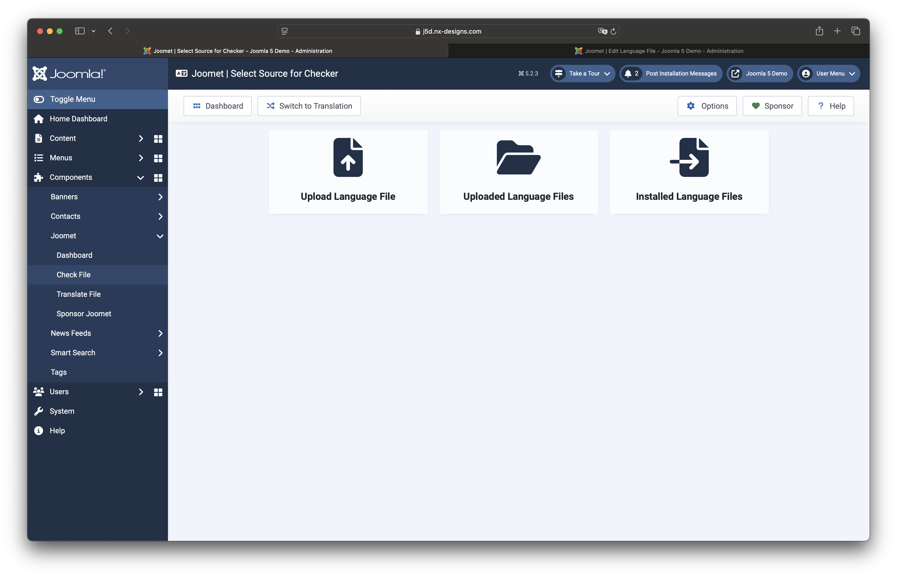

In Joomet you can upload your own files as well as check / translate the previously uploaded or language files of 
installed extensions. However, if the installed extension is a core extension, I recommend that you install the 
corresponding language pack directly in Joomla instead.

If you start in the dashboard or via the main menu with a check or a translation, you will be redirected to this page first.
forwarded to this page. Based on your selection, you can then upload a language file, call up a list of your uploaded 
language files or a list of installed extensions. The latter allows you to check / translate the installed language 
files after selecting an extension.