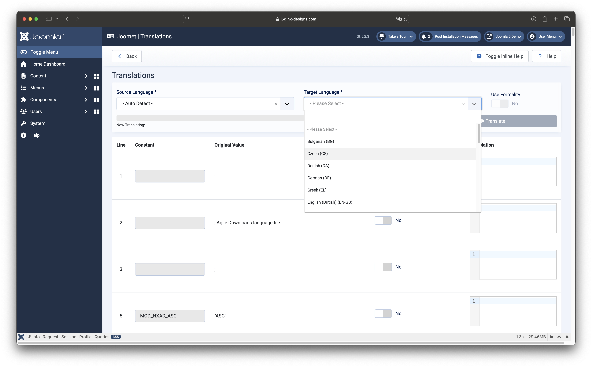
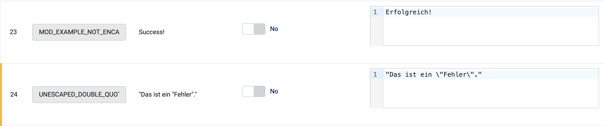
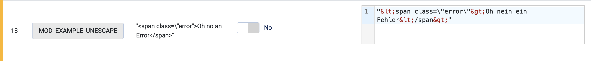

Once you have selected a file for translation, and you are on the translation page, you can define a few options before
starting the translation.

:::info
Before you translate your own files, I strongly recommend that you check them with the checker to make sure that
everything is correct. The translator cannot correct all errors - in addition, the DeepL API sometimes reacts
unpredictably to invalid HTML in a string that is to be translated.
:::

## Define Languages

You must select at least the target language using the dropdown. You will achieve the best results if you also define
the
source language.

:::warning
If no languages are displayed, or you see a corresponding error message, make sure that you have entered your correct
API key in the component settings and that the language cache has been updated.
:::

## Formality

Depending on the target language used, you have the option of activating the formal translation. However, the checkbox
is only available for languages that support the formal version.

:::info
The formality parameter "more" is used for the formal variant in the DeepL API.
:::

## Row List

Under the control section you will find a list of all lines in the selected ini file including their content.
Based on your settings in the component, empty lines or comment lines can also be displayed here.

### Skip Element Toggler

In each line you will find a checkbox that allows you to skip the translation for the corresponding line.
If this is activated, the component does not send the content of the line to DeepL and simply copies it.

### Translation Column

When the translation is started, the corresponding translation is placed in the last column. If the component notices
any errors when comparing the sent and received content, the lines after the translation are highlighted in orange and
a message is displayed next to the download button.

The translation is loaded into an editor field, which allows you to check the content again before downloading
and adapt it directly if necessary. If the Joomla! CodeMirror plugin is installed and active, you will see HTML
content is displayed with code highlighting.

In the example above, you can see such a warning on line 24. In the original string, the double quotes were not escaped
correctly. Joomet has done this for you. However, it is important to look carefully when a line has been marked.

## DeepL's Reaction to invalid HTML

As mentioned at the beginning, DeepL API sometimes reacts unpredictably if there is incorrect HTML in the string.
The example below shows this relatively well:

In such a case, DeepL API simply converts the angle brackets into their HTML entity. `<` becomes `&lt;` and `>`
becomes `&gt;`. The developers of the DeepL API are aware of this and a corresponding issue already exists:
[Problem with HTML translation](https://github.com/DeepLcom/deepl-php/issues/48).

## Download the translated File

After the file has been translated and viewed by you, you can download it at the bottom of the page using the download
button. The content remains unchanged as long as you stay on this page - so you can change individual elements or start
another translation into a different language if required.

:::warning
The component does not save the translated documents. If they are not downloaded after the translation, they must be
generated again.
:::
