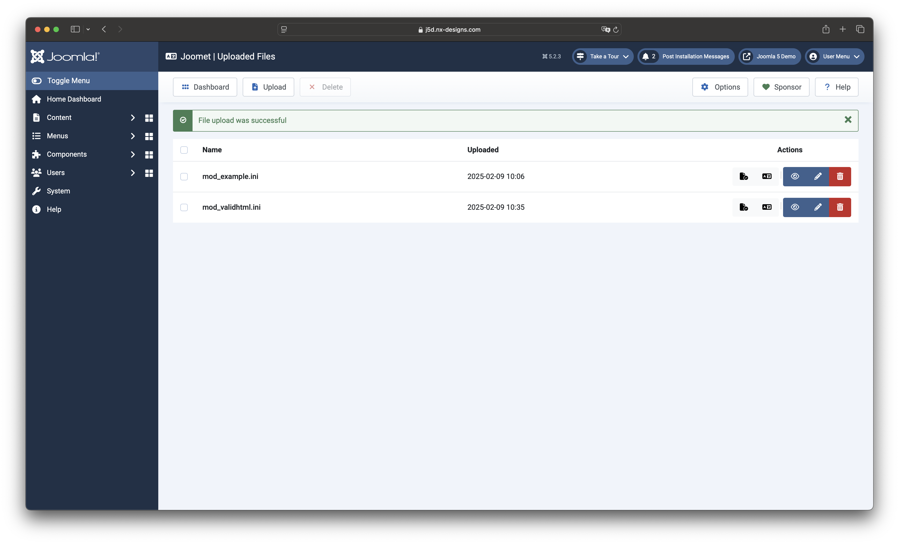

This view shows you a list of all uploaded files. If the view is called up in the context of a translation or a check, 
you can start the action directly by clicking on the file name. In the overview view, you will find the buttons for 
the actions on the right.

## Action Buttons

Die folgenden Optionen / pro Datei stehen dir zur Verfügung:

- Check
- Translate*
- View
- Edit
- Delete

:::note
A DeepL API key must be stored in the settings for the translation function.
:::

In addition, several documents can be deleted if you use the checkboxes and the Delete option in the toolbar.