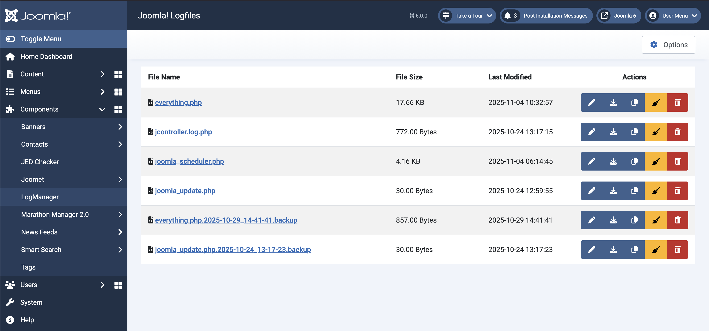

## What is LogManager?

LogManager is a Joomla! component that allows you to check and manage your Joomla! Log Files.

## Features

- View Log Files
- Copy Log Files
- Download Log Files
- Clean Log Files
- Delete Log Files
- Raw and Structured View for Log File Content

## How much does LogManager cost?

The short answer? Nothing! > Joomet was programmed for the Joomla! developer community and should support you in your
daily work. If LogManager has saved you time that you can now
spend with friends or family, I would appreciate a small thank you in the form of a donation.

## Where can I get LogManager?

You can subscribe for the free Subscription on NXD (nx-designs.ch) and download the latest version from within the
Download Section.

## How can I support you / the project?

You can support me via the two sponsoring methods [here (PayPal)](https://www.paypal.com/donate/?hosted_button_id=84H9GFDD4CNJA) or
[here (Buy me a Coffee)](https://buymeacoffee.com/nxdesigns). Of course you can also support me in the project itself,
no application is perfect after all and my "Joomla coding skills" can still be improved. Do you find bugs or do you have
improvements to the code? Create a pull request or an issue on GitHub and we'll take a look at it.