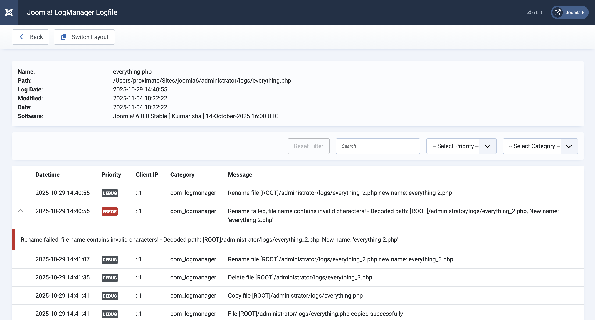

The Log Viewer displays the contents of a log file. The viewer can display the file in raw form or in a structured
format.
In the structured display, the contents of the log file are shown in a table format. Currently, the two common formats
used by Joomla! are supported.

You can define the "default view" in the component settings. Alternatively, you can temporarily change the view for a
file using the "Switch Layout" button.

:::note
It is possible that a log file cannot be displayed correctly in the structure view. If this is the case, please report
this error to us at support@nx-designs.ch and, if possible, send the file as an attachment.
:::